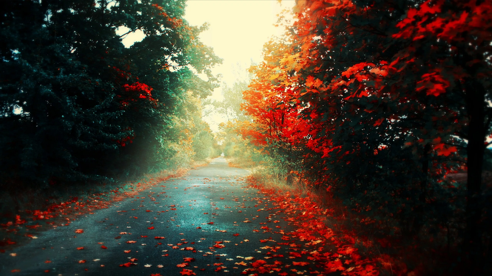

# 🖼 Слайдер 🖼


Источник:
видео от "Уроки по JavaScript. Делаем слайдер изображений на Джаваскрипт" https://vkvideo.ru/video-101965347_456257147?sel=19460369

## Алгоритм работы:

1. Создать нужные файлы

- создаем HTML (index.html), CSS (Slider_CSS.css), JS (Slider_JS.js) документ в программе "WebStorm" для работы с JavaScript (скачать бесплатную версию [https://www.jetbrains.com/webstorm/](https://www.jetbrains.com/webstorm/));
- добавляем 4 фото с размерами 1280*720px;
- в файле index.html:

  - меняем название в строке title в разделе head - Слайдер
    
    ```html
    <title>Слайдер</title>
    ```
      
  - подцепляем стиль из CSS файла в разделе head
  
    ```html
    <link rel="stylesheet" href="Slider_CSS.css">
    ```
  
  - подцепляем скрипт из JS файла в разделе body
    ```html
    <script src="Slider_JS.js"></script>
    ```

2. Создать контейнер со списком изображений

- создаем контейнер в файле index.html в разделе body:

```html
<div id="carousel" class="carousel"></div>
```

- внутри данного контейнера в файле index.html в разделе body создаем 2 кнопки "вперед" и "назад"

```html
<button class="arrow prev"> < </button>
<button class="arrow next"> > </button>
```

- чтобы вид стрелок был симпатичный, берем с сайта с символами юникод (пример: https://symbl.cc/ru) символы стрелок и вставляем в кнопки в файле index.html в разделе body
  

```html
<button class="arrow prev">⯇</button>
<button class="arrow next">⯈</button>
```

- внутри контейнера с кнопками в файле index.html в разделе body создаем еще 1 контейнер со списком изображений. Изображения для удобства помещаем в папку "images"

```html

<div class="gallery">
  <ul class="images">
    <li></li>
    <li></li>
    <li></li>
    <li></li>
  </ul>
</div>
```

- в файле Slider_JS.js задаем нужную ширину и количество (счётчик) изображений, которые будут изначально выводится в нашей галерее

```JS
var width = 1280; //ширина изображения
var count = 1; //изначально будет видна только 1 картинка
```

- сослаться на всю нашу карусель в файле Slider_JS.js

```JS
var carousel = document.getElementById('carousel');
```

- создать список изображений в файле Slider_JS.js, чтобы использовать в JS как 1 переменную.
  Выбираем для этого переменную querySelector, т.к. он возвращает соответствующий списку в HTML изображение.

```JS
var list = carousel.querySelector('ul'); 
//т.к. мы знаем, что у нас 1 ul список в HTML
var listElements = carousel.querySelectorAll('li'); 
//т.к. мы знаем, что у нас несколько изображений в списке li
```

- определить изначальную позицию наших картинок. Изначально она нулевая.

```JS
var position = 0;
```

3. Сдвигаем список (работа в файле Slider_JS.js)

- чтобы найти все элементы за тэгом внутри элемента, используют метод getElementsByTagName

```JS
var lis = document.getElementsByTagName('li');
```

- добавляем цикл for, чтобы перебирать наши изображения

```JS
for (var i = 0; i < lis.length; i++) {
  //lis.length - длина списка.
  //i++ - когда цикл мы прошли, дается команда пройти его ещё раз, если список не закончился
}
```

- чтобы задать определенное положение для наших изображений, нужно установить элемент в определённом исходном месте.
Для этого используем style.position в цикле for

```JS
lis[i].style.position = 'relative';
//lis[i] - элемент списка
//relative - расположение нашего элемента относительно исходного изначального места
```

- чтобы создать между изображениями небольшой промежуток, используют метод createElement в цикле for

```JS
var span = document.createElement('span');
//span - промежуток
```

- делаем промежуток в виде текста, чтобы его потом незаметно спрятать и чтобы картинки не уехали в сторону в цикле for

```JS
span.style.cssText = 'position:absolute; left:0; top:0';
```

- промежуток между картинками делаем как 1 строчку в цикле for

```JS
span.innerHTML = 1;
```

- куда вставлять данный элемент в цикле for

```JS
lis[i].appendChild(span);
```

- чтобы выводилась одна картинка на экране и мы ее могли смещать влевво к предыдущей, используем querySelector с next.
Изначально позиция = 0 (var position = 0), поэтому начинаем с 0. В 1ом выражении Math.min = ширину множаем на счетчик 
(var count = 1; //изначально будет видна только 1 картинка)

```JS
carousel.querySelector('.prev').onclick = function() {
    position = Math.min(position + width * count, 0);
};
```

- сместить слайдер влево на определенное количество пикселей

```JS
list.style.marginLeft = position + 'px';
```

- сместить слайдер вправо на следующий слайд на определенное количество пикселей. Из position отнимаем. 
Во 2ом выражении из отрицательного значения ширины, умноженного на ширину списка, вычитаем 1 (count)

```JS
carousel.querySelector('.next').onclick = function() {
  position = Math.max(position - width * count, -width * (listElements.length - count));
  list.style.marginLeft = position + 'px';
};
```

4. чтобы работал слайд красиво, нужно указать стили в файле Slider_CSS.css

- задать поле вокруг наших элементов (padding) и сделаем задний фон (background)

```css
body {
  padding: 10px;
  background: #1f1f1f;
}
```

- застилизовать карусель по ширине и высоте

```css
.carousel img{
  width: 1280px;
  height: 729px;
  display: block;
}
```

- застилизуем нашу карусель (весь контейнер) по центру экрана. Трансформируем элементы и можем их масштабировать

```css
.carousel {
  position: absolute;
  top: 50%;
  left: 50%;
  transform: translate(-50%, -50%);
}
```

- сделать кнопку "Вперед" и кнопку "Назад", их застилизовать. 
Также сделать для нашей галереи ширину, чтобы размещалась одна картинка

```css
.gallery {
  /*менять размеры изображений по своему экрану монитора, т.к. это неадаптивный слайдер*/
  width: 1100px;
  height: 600px;
  overflow: hidden;
}
```

- сделать стиль для всего списка и стиль наших кнопок, чтобы при нажатии на них, ничего не смещалось и не перемещалось.
Перемещение со скоростью 250 миллисекунд 

```css
.gallery ul {
  height: 130px;
  width: 9999px;
  margin: 0;
  padding: 0;
  list-style: none;
  transition: margin-left 500ms; /*перемещение влево со скоростью 500 миллисекунд*/
}
```

- сделать стиль для каждой конкретной картинки из списка изображений из HTML

```css
.gallery li {
  display: inline-block;
}
```

- чтобы избежать отображения пикселей предыдущего изображения в слайдере, добавляем в .carousel "font-size: 0px". 
Но это работает, когда нет текста! Если надо с текстом, то "font-size: 0px;" не пишем, а указываем изображения в HTML в виде не списка, 
а в виде строки без пробела

```css
font-size: 0px;
```

- застилизовать кнопки

```css
.prev{
  left: -70px;
  position: absolute;
  top: 50%;
  font-size: 60px;
  background: none;
  border: none;
  outline: none;
  color: #ffffff;
  transition: transform 0.5s, color 0.2s;
  cursor: pointer;
}

.next{
  right: -70px;
  position: absolute;
  top: 50%;
  font-size: 60px;
  background: none;
  border: none;
  outline: none;
  color: #ffffff;
  transition: transform 0.5s, color 0.2s;
  cursor: pointer;
}
```

- чтобы активная кнопка меняла цвет

```css
.prev:active{
  color: aqua;
}

.next:active{
  color: aqua;
}
```

# Итог всего кода:

1. файл Slider_CSS.css:

```css
body {
  padding: 10px;
  /*задать поле вокруг наших элементов*/
  background: #1f1f1f;
  /*задний фон черный*/
}

.carousel {
  position: absolute;
  top: 50%;
  left: 50%;
  transform: translate(-50%, -50%);
  font-size: 0px; /*убирает пиксели предыдущего изображения в слайдере. Но это работает, когда нет текста!*/
}

.carousel img{
  width: 1280px;
  height: 729px;
  display: block;
}

.prev{
  left: -70px;
  position: absolute;
  top: 50%;
  font-size: 60px;
  background: none;
  border: none;
  outline: none;
  color: #ffffff;
  transition: transform 0.5s, color 0.2s;
  cursor: pointer;
}

.next{
  right: -70px;
  position: absolute;
  top: 50%;
  font-size: 60px;
  background: none;
  border: none;
  outline: none;
  color: #ffffff;
  transition: transform 0.5s, color 0.2s;
  cursor: pointer;
}

.prev:active{
  color: aqua;
}

.next:active{
  color: aqua;
}

.gallery {
  /*менять размеры изображений по своему экрану монитора, т.к. это неадаптивный слайдер*/
  width: 1100px;
  height: 600px;
  overflow: hidden;
}

.gallery ul {
  height: 130px;
  width: 9999px;
  margin: 0; /*внешний отступ*/
  padding: 0; /*внутренний отступ*/
  list-style: none;
  transition: margin-left 500ms; /*перемещение влево со скоростью 500 миллисекунд*/
}

.gallery li {
  display: inline-block;
}
```


2. файл index.html

```html
<!DOCTYPE html>
<html lang="en">
<head>
    <meta charset="UTF-8">
    <title>Слайдер</title>
    <link rel="stylesheet" href="Slider_CSS.css">
</head>
<body>
<div id="carousel" class="carousel">
    <button class="arrow prev">⯇</button>
    <div class="gallery">
        <ul class="images">
            <li></li>
            <li></li>
            <li></li>
            <li></li>
        </ul>
    </div>
    <button class="arrow next">⯈</button>
</div>
<script src="Slider_JS.js"></script>
</body>
</html>
```


3. файл Slider_JS.js

```JS
var lis = document.getElementsByTagName('li');
for (var i = 0; i < lis.length; i++) {
  //lis.length - длина списка.
  //i++ - когда цикл мы прошли, дается команда пройти его ещё раз, если список не закончился
  lis[i].style.position = 'relative';
  //lis[i] - элемент списка
  //relative - расположение нашего элемента относительно исходного изначального места
  var span = document.createElement('span');
  //span - промежуток
  span.style.cssText = 'position:absolute; left:0; top:0';
  //делаем промежуток в виде текста, чтобы его потом незаметно спрятать и чтобы картинки не уехали в сторону
  span.innerHTML = 1;
  //промежуток между картинками делаем как 1 строчку
  lis[i].appendChild(span);
  //куда вставлять данный элемент
}


var width = 1280; //ширина изображения
var count = 1; //изначально будет видна только 1 картинка

var carousel = document.getElementById('carousel');
var list = carousel.querySelector('ul');
//т.к. мы знаем, что у нас 1 ul список в HTML
var listElements = carousel.querySelectorAll('li');
//т.к. мы знаем, что у нас несколько изображений в списке (li)

var position = 0;

carousel.querySelector('.prev').onclick = function() {
  //смещаем картинки влево с помощью математики
  position = Math.min(position + width * count, 0);
  list.style.marginLeft = position + 'px';
};

carousel.querySelector('.next').onclick = function() {
  position = Math.max(position - width * count, -width * (listElements.length - count));
  list.style.marginLeft = position + 'px';
};
```


